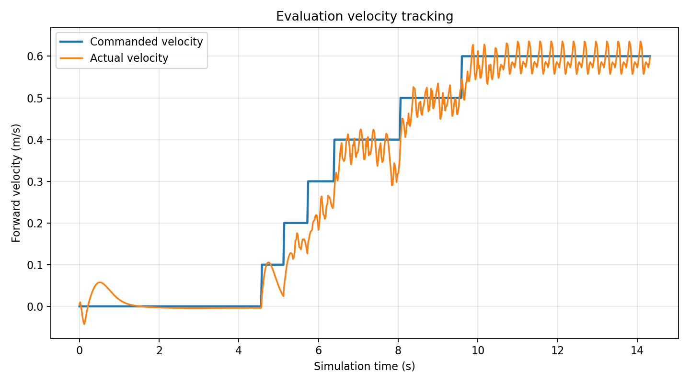

# ANYmal C Reinforcement Learning with PPO

This project trains a locomotion policy for the 12-actuator ANYmal C quadruped in the [Genesis](https://genesis-world.readthedocs.io/) simulator. PPO is provided by `rsl_rl`. The policy learns to follow commanded forward velocity, lateral velocity, and yaw rate while maintaining body height and orientation and limiting torque and abrupt action changes.

Pretrained checkpoints, TensorBoard logs, plots, and a demonstration video are included.

## Files

```text
Anymal-RL/
├── anymal_env.py                  # Vectorized Genesis locomotion environment
├── anymal_train.py                # PPO training entry point
├── anymal_eval.py                 # Interactive evaluation and robustness tests
├── performance_plots.py           # Training and velocity-tracking plots
├── requirements.txt               # Python dependencies
├── anymal_c_simple_description/   # ANYmal C URDF, meshes, and license
├── logs/                          # Checkpoints, configs, TensorBoard data, and plots
└── Results/                       # Selected plots and demonstration video
```

## Installation after cloning

Python 3.10 and a CUDA-capable GPU are recommended. Interactive evaluation requires a graphical desktop because it opens both a Genesis viewer and a PyQt5 control window.

```bash
git clone https://github.com/abdullah-tm14/CartPole-MPC-RL.git
cd CartPole-MPC-RL
```

Create and activate an isolated environment:

```bash
conda create -n anymal-rl python=3.10 -y
conda activate anymal-rl
python -m pip install --upgrade pip
python -m pip install -r Anymal-RL/requirements.txt
```

Alternatively, use `venv`:

```bash
python3.10 -m venv .venv
source .venv/bin/activate
python -m pip install --upgrade pip
python -m pip install -r Anymal-RL/requirements.txt
```

The project was tested with Genesis `0.4.6` and `rsl-rl-lib` `5.0.1`. For GPU training, install a CUDA-enabled PyTorch build appropriate for your CUDA version if necessary.

## Run the trained policy

The ANYmal scripts write and load experiment paths relative to `Anymal-RL/`, so enter that directory first:

```bash
cd Anymal-RL
python anymal_eval.py --exp_name Anymal1 --ckpt 300
```

This loads `logs/Anymal1/model_300.pt` and starts the Genesis viewer plus the teleoperation dashboard.

### Evaluation controls

| Key | Action |
| --- | --- |
| `W` / `S` | Increase/decrease forward velocity |
| `A` / `D` | Increase/decrease lateral velocity |
| `Q` / `E` | Increase/decrease yaw rate |
| `Space` | Set all velocity commands to zero |
| `1` | Toggle the fixed stand pose |
| `O` / `P` | Apply a random push along the X/Y axis |
| `K` / `C` | Randomize or manually set PD gains |
| `M` / `N` | Randomize or manually set robot masses |
| `R` | Reset the robot |
| `8` | Quit |

When the dashboard closes, a commanded-versus-measured forward-velocity plot is saved under `logs/Anymal1/performance/`.

Another included run can be evaluated with:

```bash
python anymal_eval.py --exp_name Anymal --ckpt 500
```

## Train a policy

From `Anymal-RL/`, run:

```bash
python anymal_train.py \
  --exp_name MyAnymalRun \
  --num_envs 4096 \
  --max_iterations 301
```

Default training settings use `4096` parallel environments, `301` PPO iterations, 24 simulation steps per rollout, and checkpoints every 100 iterations. The policy and value networks use hidden layers of `[512, 256, 128]` with ELU activations.

Use a new experiment name unless you intend to replace an included run. The training script deletes an existing `logs/<experiment-name>/` directory before starting, then saves the configuration, checkpoints, TensorBoard events, and performance plots there.

Inspect training metrics with:

```bash
tensorboard --logdir logs
```

## Task definition

The 45-dimensional policy observation contains body angular velocity, projected gravity, the three velocity commands, joint position offsets, joint velocities, and the previous action. The policy outputs 12 normalized joint-position targets, one for each hip and knee actuator.

Commands are sampled from:

- Forward velocity: `-1.0` to `1.0 m/s`
- Lateral velocity: `-0.5` to `0.5 m/s`
- Yaw rate: `-1.0` to `1.0 rad/s`

The reward combines linear- and angular-velocity tracking with penalties for vertical velocity, body-height error, orientation error, torque, joint acceleration, action changes, and deviation from the nominal pose. Episodes terminate on the time limit, excessive roll/pitch, or low body height.

## Included results

`Results/` contains training reward, episode length, velocity tracking, and `ANYmal-RL.webm`. `logs/` contains the complete pretrained experiments and their TensorBoard event files.



## Robot model license

The robot description is based on ANYbotics' `anymal_c_simple_description`. Its original README and license are retained in `anymal_c_simple_description/`.
