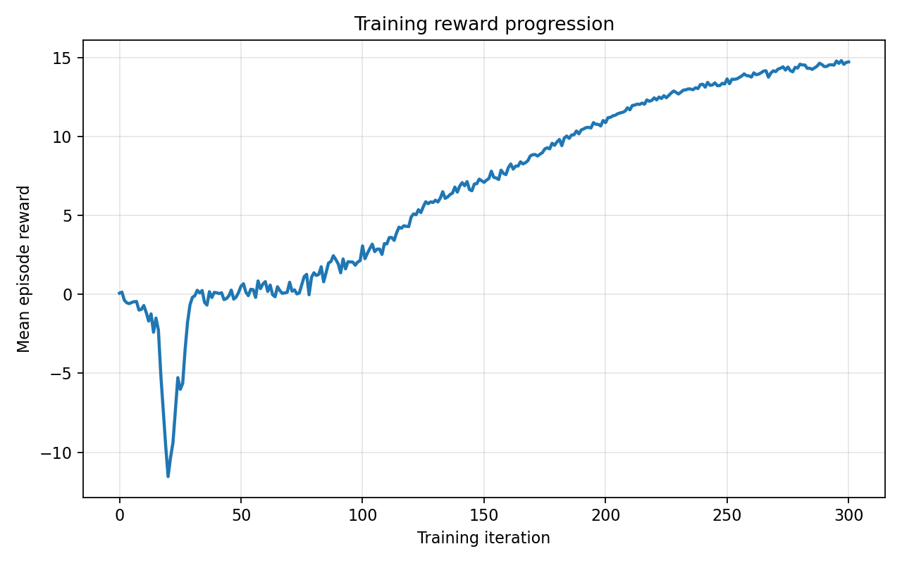

# Control and Reinforcement Learning Projects

This repository contains three control projects developed with MATLAB/Simulink and the [Genesis](https://genesis-world.readthedocs.io/) physics simulator:

- **Cart-pole with model predictive control (MPC):** a linearized cart-pole is stabilized in MATLAB and Simulink with an MPC controller.
- **Cart-pole with reinforcement learning:** a PPO policy is trained in Genesis to balance the pole while controlling the cart.
- **ANYmal C locomotion with reinforcement learning:** a 12-joint quadruped policy is trained in Genesis with PPO to follow forward, lateral, and turning velocity commands.

The trained checkpoints, TensorBoard logs, plots, and demonstration videos are included so the experiments can be inspected and the trained policies can be evaluated after cloning.

## Projects

| Project | Method | Main tools | Instructions |
| --- | --- | --- | --- |
| Cart-pole RL | PPO | Python, Genesis, `rsl_rl` | [RL/README.md](RL/README.md) |
| Cart-pole MPC | Model predictive control | MATLAB, Simulink, MPC Toolbox | [MPC/README.md](MPC/README.md) |
| ANYmal C RL | PPO | Python, Genesis, `rsl_rl` | [Anymal-RL/README.md](Anymal-RL/README.md) |

## Repository structure

```text
.
├── RL/                         # Genesis cart-pole PPO environment and scripts
│   ├── logs/                   # Checkpoints, configurations, and TensorBoard logs
│   └── Results/                # Evaluation plots and demonstration video
├── MPC/                        # MATLAB/Simulink cart-pole MPC implementation
│   └── Results and plots/      # Simulation plots, diagrams, and video
├── Anymal-RL/                  # Genesis ANYmal C PPO environment and scripts
│   ├── anymal_c_simple_description/  # Robot URDF and mesh assets
│   ├── logs/                   # Checkpoints, configurations, and TensorBoard logs
│   └── Results/                # Training/evaluation plots and video
└── README.md
```

## Quick start

Clone the repository:

```bash
git clone https://github.com/abdullah-tm14/CartPole-MPC-RL.git
cd CartPole-MPC-RL
```

Each project has separate setup and run instructions:

- [Run or train the cart-pole PPO policy](RL/README.md)
- [Run the MATLAB/Simulink MPC simulation](MPC/README.md)
- [Run or train the ANYmal C PPO policy](Anymal-RL/README.md)

The two reinforcement-learning projects use Python 3.10, Genesis `0.4.6`, and `rsl-rl-lib` `5.0.1`. Training is intended for a CUDA-capable GPU; the interactive evaluations also require a graphical desktop.

## Example results

### Cart-pole RL


### Cart-pole MPC


### ANYmal C RL



## Notes

- Running a training script with an existing experiment name replaces that experiment's log directory. Use a new `--exp_name` to preserve the included runs.
- Generated Python caches, editor files, and Simulink build caches are intentionally excluded. Results and training logs are intentionally versioned.
- The ANYmal description assets retain their upstream license in `Anymal-RL/anymal_c_simple_description/LICENSE`.
