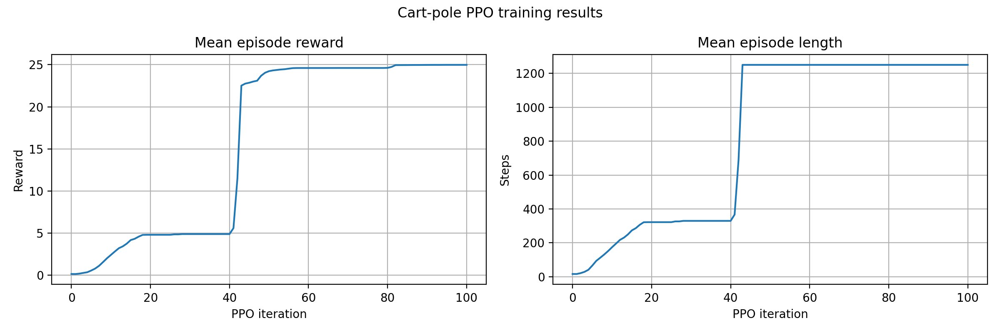

# Cart-Pole Reinforcement Learning with PPO

This project trains a PPO policy in the [Genesis](https://genesis-world.readthedocs.io/) simulator to stabilize a cart-pole in the upright position. The cart is actuated by one horizontal force, while the pole joint is passive. An angle of zero represents the upright position.

At every episode reset, the initial pole angle is sampled from:

\[
\theta_0 \sim \mathcal{U}(-20^\circ, 20^\circ)
\]

A trained checkpoint is included, so the policy can be evaluated immediately after the dependencies are installed.

## Files

```text
RL/
├── cartpole1.urdf       # Cart-pole model
├── cartpole_env.py      # Genesis vectorized environment
├── cartpole_train.py    # PPO training entry point
├── cartpole_eval.py     # Evaluation with keyboard disturbances
├── requirements.txt     # Python dependencies
├── logs/                # Checkpoints, saved configs, TensorBoard data, and plots
└── Results/             # Selected plots and demonstration video
```

## Installation after cloning

Python 3.10 is recommended. A CUDA-capable GPU is recommended for training, while the included evaluation uses the CPU backend.

```bash
git clone https://github.com/abdullah-tm14/CartPole-MPC-RL.git
cd CartPole-MPC-RL
```

Use either Conda or `venv`; there is no need to use both.

### Option 1: Conda

```bash
conda create -n cartpole python=3.10 -y
conda activate cartpole
python -m pip install --upgrade pip
python -m pip install -r RL/requirements.txt
```

### Option 2: Python virtual environment

```bash
python3.10 -m venv .venv
source .venv/bin/activate
python -m pip install --upgrade pip
python -m pip install -r RL/requirements.txt
```

The project was tested with Genesis `0.4.6` and `rsl-rl-lib` `5.0.1`. For GPU training, install a CUDA-enabled PyTorch build appropriate for your CUDA version if the automatically installed build does not support your GPU.

## Run the trained policy

From the repository root, run:

```bash
python RL/cartpole_eval.py
```

This loads `RL/logs/CartPole-RL1/model_100.pt`. Click the Genesis viewer and use:

- **Left arrow:** apply a force disturbance to the left.
- **Right arrow:** apply a force disturbance to the right.

Close the viewer or press `Ctrl+C` to stop. The evaluation plot is saved to `RL/logs/CartPole-RL1/evaluation_plots_100.png`.

To choose another saved run or checkpoint:

```bash
python RL/cartpole_eval.py --exp_name CartPole-RL1 --ckpt 100
```

## Train a policy

From the repository root:

```bash
python RL/cartpole_train.py
```

Default settings:

- Experiment name: `CartPole-RL1`
- Parallel environments: `4096`
- PPO iterations: `101`
- Backend: GPU
- Simulation timestep: `0.02 s`
- Episode duration: `25 s` (`1250` simulation steps)

All command-line options can be set explicitly:

```bash
python RL/cartpole_train.py \
  --exp_name MyCartPoleRun \
  --num_envs 4096 \
  --max_iterations 101
```

Use a new experiment name unless you intend to replace an existing log directory. Training writes `cfgs.pkl`, PPO checkpoints, TensorBoard events, and `training_plots.png` under `RL/logs/<experiment-name>/`.

To inspect TensorBoard data:

```bash
tensorboard --logdir RL/logs
```

## PPO interface

The physical state contains cart position, cart velocity, pole angle, and pole angular velocity. The policy receives five observations:

```text
[scaled cart position,
 scaled cart velocity,
 sin(pole angle),
 cos(pole angle),
 scaled pole angular velocity]
```

Using sine and cosine avoids the discontinuity between `-pi` and `+pi`. The policy outputs one action in `[-1, 1]`, which is scaled to a horizontal force on the cart.

An episode terminates when the time limit is reached, the pole exceeds `60 degrees` from upright, the cart moves more than `8 m` from the center, or Genesis reports a solver error.

## Included results

`Results/` contains selected training/evaluation plots and a demonstration video. `logs/` contains the complete saved experiment artifacts, including ready-to-run checkpoints.


